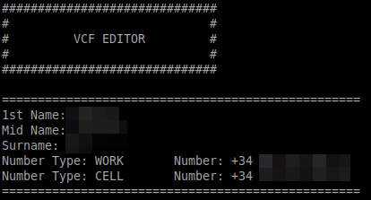
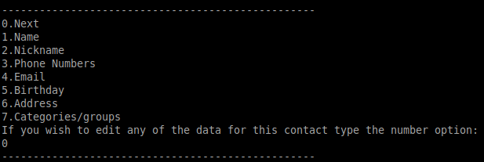
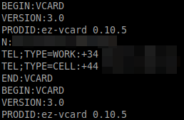

#VCFContactEditor
VCF contact parser and editor


## Usage
It reads from a file passed by parameter, and will be exporting contact data to another file appended "_parsed"


## Features
Shows the summary of the contact


Allows to edit names, nicknames, phone numbers, email addresses, location addresses, birthday dates and categories


It autoremoves duplicates in same contact and warns of duplicate values in others
It's possible to add or remove fields in contacts
It leaves a parsed file: 


## Version of files used
Tested on VCF files:
VERSION:3.0
PRODID:ez-vcard 0.10.5


## Example
There is a file to use as a test which you can try for yourself as follows:
```javac
java VCFContactEditor testcontacts
```